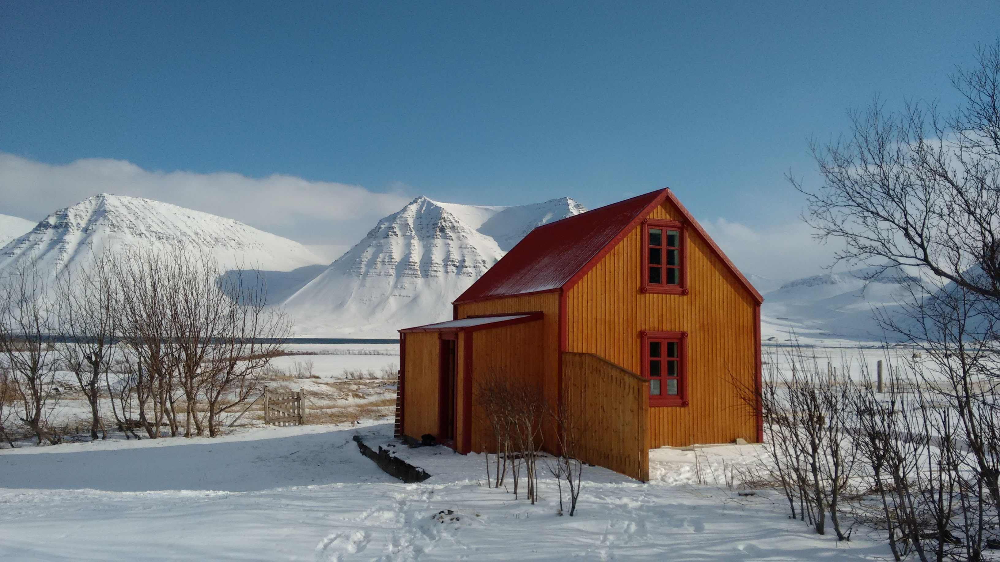

Date: 2021-10-19 1605
Tags: quote, nietzsche, parfit, convergence

# Nietzsche's mountain
> Those who can breathe the air of my writings know that it is an air of the heights, a strong air. One must be made for it. Otherwise there is no small danger one may catch cold in it. The ice is near, the solitude tremendous . . . Philosophy, as I have so far understood and lived it, means living voluntarily among ice and high mountains—seeking out everything strange and questionable in existence, everything so far placed under a ban by morality. 

—Nietzsche, Preface to Ecce Homo

